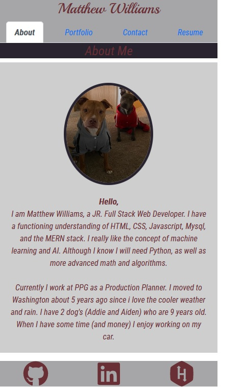

# Matthew Williams Portfolio

  []

<!-- TABLE OF CONTENTS -->

  
Table of Contents

  <ol>
    <li>
      <a href="#about-the-project">About The Project</a>
      <ul>
        <li><a href="#built-with">Built With</a></li>
      </ul>
    </li>
    <li><a href="#usage">Usage</a></li>
    <li><a href="#contributing">Contributing</a></li>
    <li><a href="#license">License</a></li>
    <li><a href="#contact">Contact</a></li>
    <li><a href="#acknowledgments">Acknowledgments</a></li>
  </ol>

 
 

<!-- DESCRIPTION -->
## DESCRIPTION

<!--  -->

This is my personal porfolio so showcase my programming skills to potential employers.

This application was built primarily utilizing the following programming languages:

* CSS
* HTML
* Javascript
* React

### Installation

N/A

<!-- USAGE EXAMPLES -->
## Usage

Go to the webpage.  Once there you can click any link in the header to be taken to that page of the application. If you click any image in the portfolio page it will take you to that deployed application. Also on the resume tab you can click the resume to open it and download if wanted.

<!-- CONTRIBUTORING -->
## Contributing

N/A

<!-- LICENSE -->
## License

See https://opensource.org/licenses/MIT LICENSE for more information.

<!-- TEST -->
## TEST
N/A

<!-- Questions -->
## Questions?

Github Profile : <a href="https://github.com/matwll">matwll</a>
For questions [Email me @](mailto: maw01091989@gmail.com)
